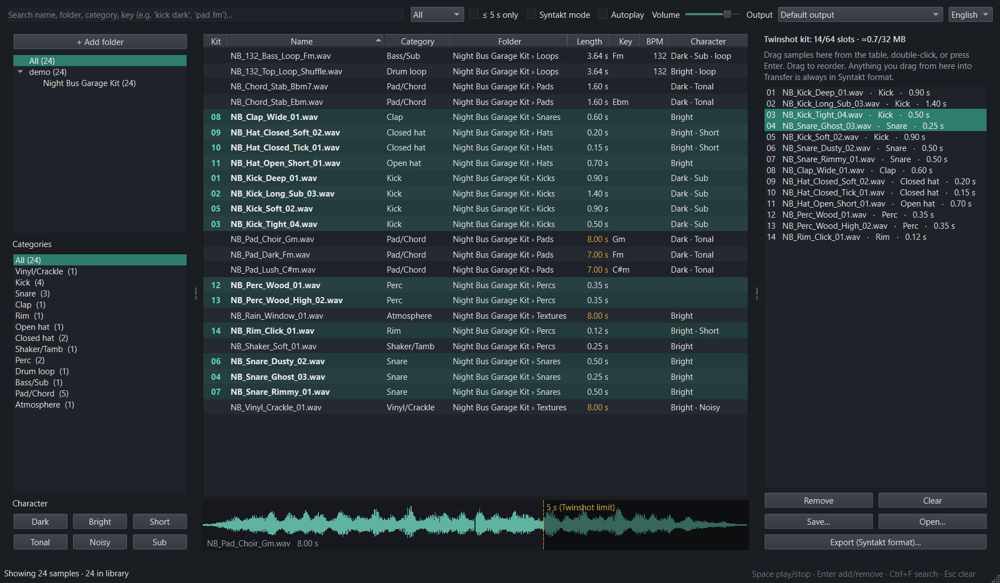

# Syntakt Sample Browser

A small desktop app for building **Elektron Syntakt Twinshot** kits from the sample packs you already have.
Scan a folder, click to listen, drag the sounds you like straight into Elektron Transfer — already converted to
the format the Syntakt wants.

**[⬇ Download the latest release](https://github.com/executionreverted/syntakt-sample-browser/releases/latest)** ·
Windows and macOS (Apple Silicon) · free · open source



*[Türkçe açıklama aşağıda ↓](#türkçe)*

## Why

Since OS 1.40 the Syntakt can play your own samples with the **SP Twinshot** machine. It's limited on purpose:
**64 sample slots, 32 MB in total, up to 5 seconds each, 48 kHz / 16-bit / mono**. Most sample packs ship
24-bit stereo files with long tails, so picking 64 sounds out of thousands and converting each one by hand gets old
fast. This app does the finding, listening and converting for you.

## What it does

- **Scans only the folders you add.** Results are cached, so the next launch is instant. *Rescan* only looks at
  new or changed files.
- **Sorts sounds into categories** from file and folder names: kick, snare, clap, rim, closed/open hat,
  ride/crash, shaker, perc, tom, drum loop, bass, pad/chord, keys, synth, vocal, vinyl crackle, atmosphere,
  foley, FX. If the name doesn't say, it guesses from the sound itself (marked with `~`).
- **Filters by sound character:** dark, bright, tonal, noisy, sub-heavy, short. Right-click → *Find similar*
  lists the sounds that are closest to the one you picked.
- Reads **key / note and BPM** from file names, tells one-shots from loops.
- **Click or use the arrow keys to listen.** The waveform shows where the 5-second Twinshot limit cuts.
- **Syntakt mode** (on by default): what you hear and what you drag out is the converted file — mono,
  48 kHz, 16-bit, silence trimmed, cut to 5 s with a fade, normalized to −1 dBFS. Small files, no MP3 artifacts.
- **Kit panel:** collect your sounds, **drag to reorder** (the order is the slot order), watch the *slots / MB*
  counter (64 / 32 MB), export them as numbered files. Sounds already in the kit are **highlighted in the table**
  with their slot number.
- **Click the waveform** to play from that point. Window layout, column widths and your kit are remembered.
- **English and Turkish** interface (switch at the top right).
- Everything stays on your computer. No account, no internet needed.

## How to use

1. **+ Add folder** → pick a sample pack folder. It gets scanned once.
2. Narrow it down with the **category list**, the **character buttons** or the **search box**
   (e.g. `kick dark`, `pad fm`, `shaker`).
3. **Click** a sound to play it. Browse with **↑ / ↓**.
4. Add sounds to the kit: **double-click**, **Enter**, or drag them into the right panel (drop them exactly
   where you want them). Drag inside the kit to change the order.
5. Get them onto the Syntakt:
   - open **Elektron Transfer**, connect the Syntakt, go to the samples page, and
   - **drag** rows from the table or the kit panel into Transfer, **or**
   - click **Export**, pick a folder, and drag that folder's files into Transfer.
6. On the Syntakt, put the **SP Twinshot** machine on a digital track and choose your samples.

| Key | Action |
| --- | --- |
| ↑ / ↓ | next / previous sound (plays it when *Autoplay* is on) |
| Space | play / stop |
| Enter, double-click | add to kit (or remove, if it's already in) |
| Ctrl+F / Esc | search / clear search |
| Del (in the kit) | remove from kit |
| Ctrl+↑ / Ctrl+↓ (in the kit) | move the selected slots up / down |
| Right-click | add/remove, find similar, show in Explorer/Finder, copy path |

**Tips**

- **Transfer won't connect?** On Windows only one program can use the Syntakt's MIDI port at a time.
  Close Ableton (or any other DAW) and try again.
- Twinshot plays two layers per track. A good trick: slot 1 = a short transient (rim, click, kick),
  slot 2 = a body or texture (pad stab, vinyl crackle).
- Sounds longer than 5 s are shown in orange. They still work, they just get cut with a fade.

## First launch warnings

The app isn't code-signed (that costs money), so your OS will be cautious the first time:

- **Windows:** SmartScreen says *"Windows protected your PC"* → **More info → Run anyway**.
- **macOS:** right-click the app → **Open**. If it's still blocked, go to
  **System Settings → Privacy & Security → Open Anyway**.
  Intel Macs: please run it from source (below).

## Run from source

Needs Python 3.10+.

```bash
pip install -r requirements.txt
python sample_browser.py
```

Where data is kept (cache, settings, converted files): next to `sample_browser.py` in `data/` when run from source;
`%LOCALAPPDATA%\SyntaktSampleBrowser` (Windows app) or `~/Library/Application Support/SyntaktSampleBrowser`
(macOS app).

### Build it yourself

```bash
pip install pyinstaller
pyinstaller --onefile --windowed --name SampleBrowser sample_browser.py      # Windows
pyinstaller --windowed --name "Sample Browser" sample_browser.py            # macOS
```

Releases are built by GitHub Actions when a `v*` tag is pushed (`.github/workflows/release.yml`).
`tools/make_demo_samples.py` makes a small synthetic kit for testing, and `tools/smoke_test.py` runs the app on it
end to end.

## Notes

- Not affiliated with or endorsed by Elektron. *Syntakt*, *Twinshot* and *Transfer* are Elektron's.
- License: [MIT](LICENSE).

---

## Türkçe

**Syntakt Sample Browser**, elindeki sample paketlerinden **Elektron Syntakt Twinshot** kiti hazırlamak için küçük
bir masaüstü uygulaması. Klasörü tara, tıklayıp dinle, beğendiklerini Elektron Transfer'e sürükle. Dosyalar
Syntakt'ın istediği formata kendiliğinden çevrilir.

**[⬇ Son sürümü indir](https://github.com/executionreverted/syntakt-sample-browser/releases/latest)**
(Windows ve Apple Silicon Mac)

### Neden?

Syntakt OS 1.40'tan beri **SP Twinshot** makinesiyle kendi sample'larını çalabiliyor. Sınırları şunlar:
**64 slot, toplam 32 MB, sample başına en fazla 5 saniye, 48 kHz / 16-bit / mono**. Paketlerdeki dosyalar
genelde 24-bit stereo ve uzun kuyruklu. Binlerce ses arasından 64 tane seçip hepsini tek tek dönüştürmek
yorucu. Bu uygulama seçmeyi, dinlemeyi ve dönüştürmeyi kolaylaştırıyor.

### Neler yapıyor?

- **Sadece eklediğin klasörleri tarar** ve sonuçları saklar. Bir sonraki açılışta beklemezsin. *Yeniden tara*
  sadece yeni ya da değişen dosyalara bakar.
- Sesleri dosya ve klasör adına göre **kategorilere ayırır** (kick, snare, clap, rim, hat, shaker, perc, pad,
  bas, vokal, vinyl cızırtısı, atmosfer, foley, FX…). Adından anlaşılmıyorsa sesin kendisine bakıp tahmin eder,
  bunlar `~` ile işaretlenir.
- **Karakter filtreleri:** karanlık, parlak, tonal, gürültülü, sub, kısa. Sağ tık → *Benzerlerini bul*.
- Dosya adından **ton/nota ve BPM** okur, one-shot ile loop'u ayırır.
- **Tıkla ya da ok tuşlarıyla gez, çalsın.** Dalga formunda 5 saniye sınırının nereden kestiği görünür.
- **Syntakt modu:** duyduğun ve sürüklediğin dosya dönüştürülmüş halidir (mono, 48 kHz, 16-bit, sessizlik
  kesilmiş, en fazla 5 sn, −1 dB normalize).
- **Kit paneli:** seslerini topla, **sürükleyerek sırala** (sıra = slot sırası), *slot / MB* sayacını takip et
  (64 / 32 MB), numaralı dosyalar olarak dışa aktar. Kitteki sesler **tabloda renkli** ve slot numarasıyla görünür.
- **Dalga formuna tıkla**, oradan çalsın. Pencere düzeni, sütunlar ve kitin hatırlanır.
- Arayüz **İngilizce** açılır. **Türkçe** için sağ üstteki dil menüsünü kullan, seçimin hatırlanır.
- Her şey senin bilgisayarında kalır. Hesap ya da internet gerekmez.

### Nasıl kullanılır?

1. **+ Klasör ekle** (İngilizcede *+ Add folder*) ile bir sample klasörü seç.
2. Soldaki **kategori listesi**, **karakter düğmeleri** ya da **arama kutusu** ile daralt (`kick karanlık`,
   `kick dark`, `pad fm`, ikisi de çalışır).
3. Bir sese **tıkla**, çalsın. **↑ / ↓** ile gez, **Boşluk** ile çal/durdur.
4. Kite eklemek için **çift tıkla**, **Enter**'a bas ya da sağdaki panelde istediğin yere sürükle.
   Zaten kitteyse aynı hareket kitten çıkarır. Kitin içinde sürükleyerek sırayı değiştir,
   **Del** ile çıkar, **Ctrl+↑/↓** ile kaydır.
5. **Elektron Transfer**'i aç, Syntakt'ı bağla. Tablodan ya da kit panelinden sesleri Transfer'e **sürükle**.
   Ya da **Dışa aktar** ile bir klasöre çıkar, oradan sürükle.
6. Syntakt'ta bir dijital track'e **SP Twinshot** makinesini koy ve sample'larını seç.

**Transfer bağlanmıyorsa:** Windows'ta Syntakt'ın MIDI portunu aynı anda sadece bir program kullanabilir.
Ableton gibi DAW'ları kapatıp tekrar dene.

**İlk açılışta uyarı:** Uygulama imzalı değil. Windows'ta *Daha fazla bilgi → Yine de çalıştır*.
Mac'te sağ tık → *Aç* ya da *Sistem Ayarları → Gizlilik ve Güvenlik → Yine de Aç*.
